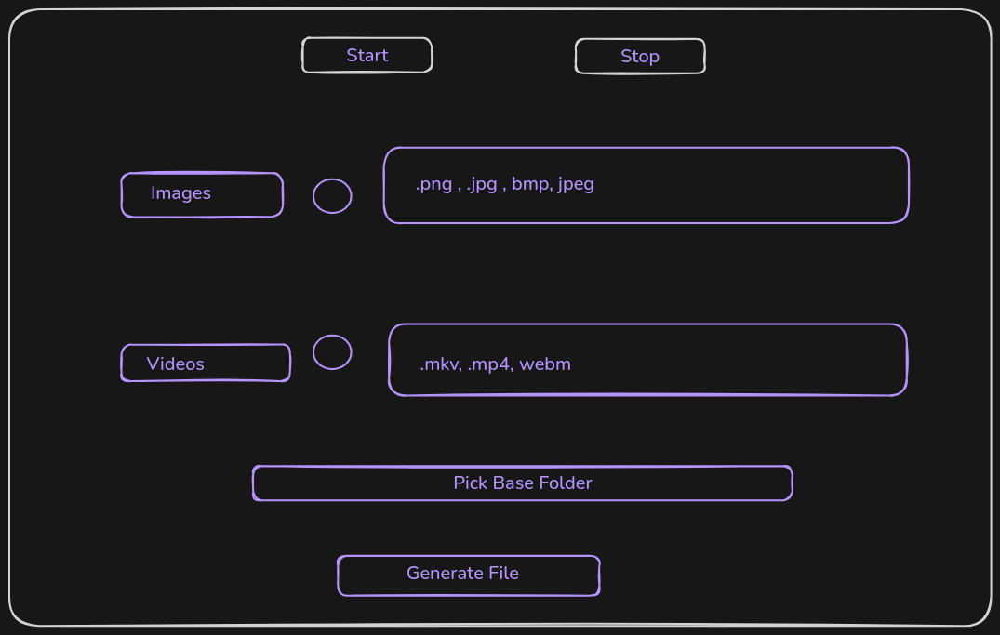

# gtk_multimedia_organiser

The aim of this project is to organise multimedia files present in a folder by creating or taking categorised subfolders.

for instance, we have some files in download folder that are images, videos, pdf , documents etc what our program will do is simply going to create some folders like images videos documents and there it will move all the files.

## USAGE

you would need a configuration file called config.conf (when you install it from the official installer you can find the config file already present in the diretory specified below)

**Windows** : type %APPDATA% in the file manager there you could see the folder gtk_multimedia_organiser(the folder contains a dummy config file all commented)
**Linux** : configuration file is in the .config folder inside gtk_multimedia_organiser(the folder contains the dummy file all commented)

Some things to keep in mind:

1. you are required to specify `source_path`
2. `dest_path` is optional ( if not specified destination path would be the source path itself)
3. you can only specify the source path then the program will organise file one the basis of extension

``` Config.conf
# source directory 1
[source_directory_1]
source_path = C:\Users\{USER_NAME}\Downloads
dest_path = C:\Users\{USER_NAME}\Desktop
images = .png, .jpg, .jpeg, .webp, .gif
documents = .pdf, .txt, .docx
videos = .mp4, .mkv, .avi
music = .mp3, .wav, .flac
others = .zip, .tar.gz, .rar

# source directory 2
[source_directory_2]
source_path = C:\Users\{USER_NAME}\Documents #source_path is also dest_path
images = .bmp, .svg, .png
documents = .pdf, .txt
audio = .mp3, .ogg
archives = .zip, .tar, .rar

# source directory 3
[source_directory_3]
source_path = C:\Users\{USER_NAME}\Videos #organises file on the basis of extension

```

## Prototype



## Contributing

To contribute do any of the above sections under [[ROADMAP.md]] checkout [[CONTRIBUTING.md]]
